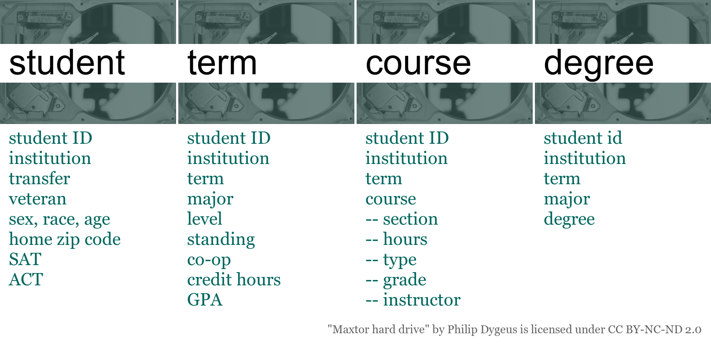

# Explore the data {#explore-the-data}

```{r echo = FALSE}
source("utils.R")

library(data.table)
library(midfieldr)
library(midfielddata)

add_row_num <- function(group) {
  group[, row := row.names(group)]
  setcolorder(group, c("row"))
}

# data(student)
# data(term)
# data(course)
# data(degree)
```

```{r echo = FALSE}
# Create the case tables
# 
# case_mcid <- "MID25836044"
# 
# case_student <- student[mcid == case_mcid]
# case_term    <- term[mcid == case_mcid]
# case_course  <- course[mcid == case_mcid]
# case_degree  <- degree[mcid == case_mcid]
# 
# saveRDS(case_student, "data/case1_student.rds")
# saveRDS(case_term,    "data/case1_term.rds")
# saveRDS(case_course,  "data/case1_course.rds")
# saveRDS(case_degree,  "data/case1_degree.rds")
```


```{r echo = FALSE}
htmltools::img(src = , 
               alt   = "logo", 
               style = "left:0px; padding:0px;")
```


## Guiding questions

Here are some guiding questions for exploring a student’s academic “story”

1. What can you tell about their demographics?
2. What were their pre-college test scores?
3. When did they start?
4. What major did the student start in?
5. Did they change majors? If so, from what to what and when?
6. What courses did they do well in?
7. Did they repeat any courses?
8. Did they graduate?  How long did it take them?

We will go through Case 1 together.  Then, we will break into small groups to summarize the story of Case 2. 

## Case 1

We selected a student from the midfielddata practice data and extracted their  unit records from the four MIDFIELD tables. In the first table below we decode  the CIP program codes that appear in this student's record.

[`cip`](https://midfieldr.github.io/midfieldr/reference/cip.html){target="_blank"} Link to data dictionary 

<br>
*decoding* the CIP
```{r echo = FALSE}
# Decoding the CIP
program <- filter_search(cip, keep_text = c("140102", "140801"))
program <- program[, .(cip6, cip4name)]
kable2html(program)
```


### Case 1 `student` record

```{r echo = FALSE}
case <- readRDS("data/case1_student.rds")
case <- data.table(case)
n <- ncol(case)
sel_1 <- paste(names(case)[1:6], sep = ", ")
sel_2 <- paste(names(case)[7:n], sep = ", ")
group_1 <- case[, ..sel_1]
group_2 <- case[, ..sel_2]

group_1 <- add_row_num(group_1)
group_2 <- add_row_num(group_2)
```

[`student`](https://midfieldr.github.io/midfielddata/reference/student.html){target="_blank"} Link to data dictionary 

<br>
*student data* for the selected student (part 1)
```{r echo = FALSE}
kable2html(group_1)
```

<br>
*student data* for the selected student (part 2)
```{r echo = FALSE}
kable2html(group_2)
```


### Case 1 `term` record

```{r echo = FALSE}
case <- readRDS("data/case1_term.rds")
n <- ncol(case)
sel_1 <- paste(names(case)[1:7], sep = ", ")
sel_2 <- paste(names(case)[8:n], sep = ", ")
group_1 <- case[, ..sel_1]
group_2 <- case[, ..sel_2]

group_1 <- add_row_num(group_1)
group_2 <- add_row_num(group_2)
```

[`term`](https://midfieldr.github.io/midfielddata/reference/term.html){target="_blank"} Link to data dictionary 

<br>
*term data* for the selected student (part 1)
```{r echo = FALSE}
kable2html(group_1)
```

<br>
*term data* for the selected student (part 2)
```{r echo = FALSE}
kable2html(group_2)
```


### Case 1 `course` record

```{r echo = FALSE}
case <- readRDS("data/case1_course.rds")
n <- ncol(case)
sel_1 <- paste(names(case)[1:6], sep = ", ")
sel_2 <- paste(names(case)[7:n], sep = ", ")
group_1 <- case[, ..sel_1]
group_2 <- case[, ..sel_2]

group_1 <- add_row_num(group_1)
group_2 <- add_row_num(group_2)
```

[`course`](https://midfieldr.github.io/midfielddata/reference/course.html){target="_blank"} Link to data dictionary 

<br>
*course data* for the selected student (part 1)
```{r echo = FALSE}
kable2html(group_1)
```

<br>
*course data* for the selected student (part 2)
```{r echo = FALSE}
kable2html(group_2)
```


### Case 1 `degree` record

```{r echo = FALSE}
case <- readRDS("data/case1_degree.rds")
n <- ncol(case)
sel_1 <- paste(names(case), sep = ", ")
group_1 <- case[, ..sel_1]

group_1 <- add_row_num(group_1)
```

[`degree`](https://midfieldr.github.io/midfielddata/reference/degree.html){target="_blank"} Link to data dictionary  

<br>
*degree data* for the selected student
```{r echo = FALSE}
kable2html(group_1)
```


## Case 2

```{r echo = FALSE}
# case2_mcid <- "MID26035311"
# 
# case2_student <- student[mcid == case2_mcid]
# case2_term    <- term[mcid == case2_mcid]
# case2_course  <- course[mcid == case2_mcid]
# case2_degree  <- degree[mcid == case2_mcid]
# 
# saveRDS(case2_student, "data/case2_student.rds")
# saveRDS(case2_term,    "data/case2_term.rds")
# saveRDS(case2_course,  "data/case2_course.rds")
# saveRDS(case2_degree,  "data/case2_degree.rds")
```

We selected a second student from the midfielddata practice data and extracted their  unit records from the four MIDFIELD tables. In the first table below we decode  the CIP program codes that appear in this student's record.

[`cip`](https://midfieldr.github.io/midfieldr/reference/cip.html){target="_blank"} Link to data dictionary 

<br>
*decoding* the CIP
```{r echo = FALSE}
# Decoding the CIP
program <- filter_search(cip, keep_text = c("140701", "141001"))
program <- program[, .(cip6, cip4name)]
kable2html(program)
```


### Case 2 `student` record

```{r echo = FALSE}
case2 <- readRDS("data/case2_student.rds")
n <- ncol(case2)
sel_1 <- paste(names(case2)[1:7], sep = ", ")
sel_2 <- paste(names(case2)[8:n], sep = ", ")
group_1 <- case2[, ..sel_1]
group_2 <- case2[, ..sel_2]

group_1 <- add_row_num(group_1)
group_2 <- add_row_num(group_2)
```

[`student`](https://midfieldr.github.io/midfielddata/reference/student.html){target="_blank"} Link to data dictionary 

<br>
*student data* for the selected student (part 1)
```{r echo = FALSE}
kable2html(group_1)
```

<br>
*student data* for the selected student (part 2)
```{r echo = FALSE}
kable2html(group_2)
```


### Case 2 `term` record

```{r echo = FALSE}
case2 <- readRDS("data/case2_term.rds")
n <- ncol(case2)
sel_1 <- paste(names(case2)[1:7], sep = ", ")
sel_2 <- paste(names(case2)[8:n], sep = ", ")
group_1 <- case2[, ..sel_1]
group_2 <- case2[, ..sel_2]

group_1 <- add_row_num(group_1)
group_2 <- add_row_num(group_2)
```

[`term`](https://midfieldr.github.io/midfielddata/reference/term.html){target="_blank"} Link to data dictionary 

<br>
*term data* for the selected student (part 1)
```{r echo = FALSE}
kable2html(group_1)
```

<br>
*term data* for the selected student (part 2)
```{r echo = FALSE}
kable2html(group_2)
```


### Case 2 `course` record

```{r echo = FALSE}
case2 <- readRDS("data/case2_course.rds")
n <- ncol(case2)
sel_1 <- paste(names(case2)[1:6], sep = ", ")
sel_2 <- paste(names(case2)[7:n], sep = ", ")
group_1 <- case2[, ..sel_1]
group_2 <- case2[, ..sel_2]

group_1 <- add_row_num(group_1)
group_2 <- add_row_num(group_2)
```

[`course`](https://midfieldr.github.io/midfielddata/reference/course.html){target="_blank"} Link to data dictionary 

<br>
*course data* for the selected student (part 1)
```{r echo = FALSE}
kable2html(group_1)
```

<br>
*course data* for the selected student (part 2)
```{r echo = FALSE}
kable2html(group_2)
```


### Case 2 `degree` record

```{r echo = FALSE}
case2 <- readRDS("data/case2_degree.rds")
n <- ncol(case2)
sel_1 <- paste(names(case2), sep = ", ")
group_1 <- case2[, ..sel_1]

group_1 <- add_row_num(group_1)
```

[`degree`](https://midfieldr.github.io/midfielddata/reference/degree.html){target="_blank"} Link to data dictionary  

<br>
*degree data* for the selected student
```{r echo = FALSE}
kable2html(group_1)
```


<br>
[&#9650; top of page](#explore-the-data)

